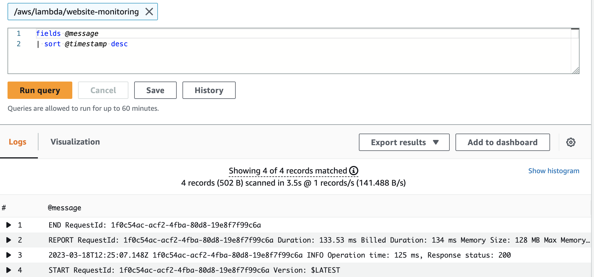

## Website Monitoring with Lambda, CDK and SNS

In this example, a Lambda function will be deployed to monitor a website by making an HTTP GET request. If the response status is not successful (200), it will send an alert message to an SNS topic. CloudWatch Events will trigger the Lambda function every five minutes, while response messages will be recorded in a CloudWatch Log Group.

Logs can be queired using the Cloudwatch Logs Insights Console

In order to deploy this example, following requeirements are neded:

NodeJS and NPM
    https://nodejs.org/en/download

AWS CDK CLI
    https://docs.aws.amazon.com/cdk/v2/guide/cli.html

Valid AWS Config
    https://docs.aws.amazon.com/cli/latest/userguide/cli-chap-configure.html

In order to deploy it

1. Provide necessary environment variables in .env file

2. Install dependencies for the Lambda handler (`cd src && npm i`)

3. Install dependencies for the CDK project (`cd ..&& npm i`)

4. Bootstrap AWS Environment (`cdk bootstrap`) or if you are using specific AWS profile (`cdk bootstrap --profile myprofile`)
   
5. Deploy using the CDK CLI (`cdk deploy`) or (`cdk deploy --profile myprofile`)

6. Approve the resource creation: `Do you wish to deploy these changes` `Y`

After you are done with this example, remove the resources created
`cdk destroy`
